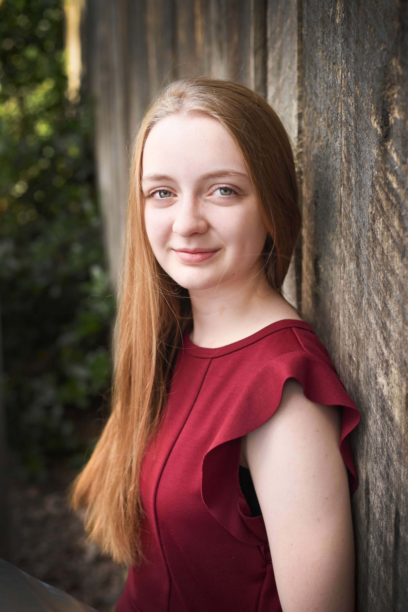

<h1>About Me</h1>

 

**I'm Daphne, a senior at New Century Technology High School. I am involved in Girl Scouts as well, and that brought me to create Waggle Dance, my Gold Award project. Before Waggle Dance, I had taken classes about Python, C and C++, ARM Assembly, and Java, but this project was the first time I ever tried machine learning or making a website.**

**I want to study computer science, specifically AI and machine learning, in college. I wanted Waggle Dance to reflect my passion for artificial intelligence (and bees), so that I could get more experience in the subject before I really decided what I wanted. After I graduate, I hope to get my PhD so that I can research artificial intelligence and be on the forefront of AI technology.**

**I also participate in theater at my school and locally. I've won an award at Trumbauer (a theater competition) for my performance of Tilly in *She Kills Monsters,* which is funny because of my love of Dungeons and Dragons since I was a child.**

**I'd been planning Waggle Dance for about a year before I actually got the approval of my Girl Scout council to start my project, so thank you for visiting my website! I hope you like it, and if you have an issue, feel free to leave a comment [here](https://github.com/dmmartin888/dmmartin888.github.io/issues).** 
